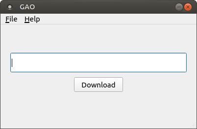

# GAO

GAO (Get Audio Only) is a software for extracting audio from Youtube videos.

## Screenshot



## Dependencies

- ffmpeg
- PyQt5
- youtube-dl

First, make sure you have installed `ffmpeg` on your operating system and run the following command:

```
$ pip install -r requirements.txt
```

## Usage

Run this command to run the program:

```
$ python gao.py
```

Enter the video URL in the input field and click the "Download" button and wait until a message appears stating that the download has completed.

## License

This project is licensed under [MIT License](LICENSE).
